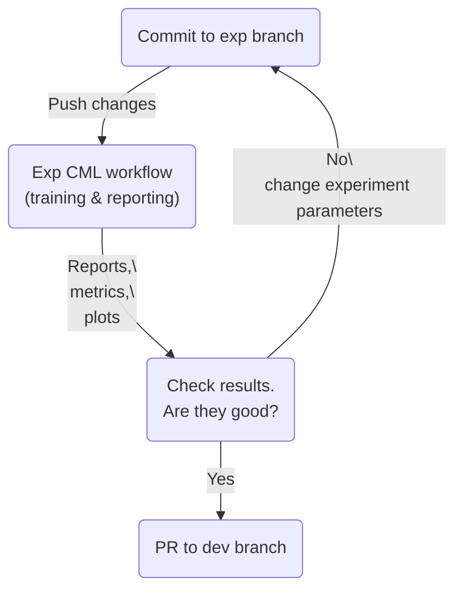
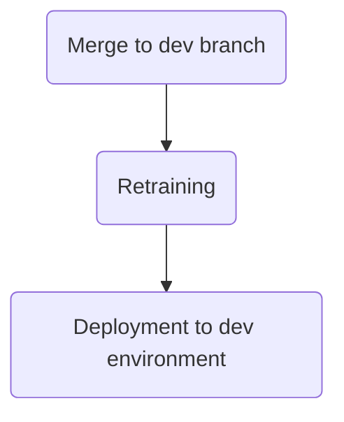
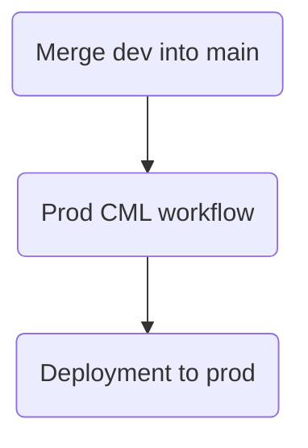

### Introduction

A typical ML project lifecycle goes through 3 phases:

- Active exploration or proof-of-concept phase. Here we try many different
  approaches to data preprocessing, model architectures and hyperparameter
  tuning with the goal to finally settle on the most promising combination
- Application development phase. Here we build all the “plumbing” around the
  model, that is: getting input data, massaging it into the right format,
  passing it to the model and, finally, serving the model's output. The goal
  here is to end up with a version of an end-to-end application that is robust
  and well-performing enough to be considered for deployment to the production
  environment.
- Production deployment phase. Here we promote a well-tested version of the
  application from the development environment to the production environment.

This blog post will describe an approach that streamlines all three phases. As
our demo project, we've selected a very common deployment pattern in CV
projects: a CV model wrapped in a web API service. Automatic defect detection is
an example problem that we are addressing with this pattern. Specifically, we'll
perform an
[image segmentation](https://ai.stanford.edu/~syyeung/cvweb/tutorial3.html) task
on a magnetic tiles dataset first introduced in this
[paper](https://www.researchgate.net/profile/Congying-Qiu/publication/327701995_Saliency_defect_detection_of_magnetic_tiles/links/5b9fd1bd45851574f7d25019/Saliency-defect-detection-of-magnetic-tiles.pdf)
and available in this GitHub
[repository](https://github.com/abin24/Magnetic-tile-defect-datasets.).

We assume the target audience of this post to be technical folks (e.g. Software
Engineers, ML Engineers, Data Scientists) who are familiar with the general
Machine Learning and Computer Vision concepts, Python programming, CI/CD
processes and Cloud infrastructure.

Familiarity with the Iterative ecosystem of tools such as
[DVC](https://dvc.org/), [CML](https://cml.dev/) and
[Studio](https://studio.iterative.ai/) is not required but would help with
understanding the nuances of our solution.

### Summary of the Solution

All the code for the project is stored in this GitHub
[repository](https://github.com/iterative/magnetic-tiles-defect).

The CV API solution that we are proposing can be summarized in the following
steps:

- A client service will make a POST request with an image as a payload to our
  API endpoint
- The image will be preprocessed to adhere to the specifications that our model
  expects
- The CV model will ingest the processed image and output its prediction image
  mask
- Some postprocessing will be applied to the image mask
- A reply back to the client with the output mask

The repository also contains code for the web application itself, which can be
found in the
[`app`](https://github.com/iterative/magnetic-tiles-defect/tree/master/app)
directory. While the web application is very simple, its implementation is
beyond the scope of this blog post. In short, we can say that it's based on the
[`FastAPI`](https://fastapi.tiangolo.com/) library, and we deploy it to the
Heroku platform through a Docker container defined in this
[`Dockerfile`](https://github.com/iterative/magnetic-tiles-defect/blob/master/Dockerfile).


### Prerequisites for Reproduction

Feel free to fork the
[repository](https://github.com/iterative/magnetic-tiles-defect) if you'd like
to replicate our steps and deploy your own API service. Keep in mind that you'll
need the setup and configure the following:

- GitHub account and
  [GitHub application token](https://docs.github.com/en/authentication/keeping-your-account-and-data-secure/creating-a-personal-access-token)
- [`pipenv`](https://pipenv.pypa.io/en/latest/) installed locally
- AWS account,
  [access keys](https://aws.amazon.com/premiumsupport/knowledge-center/create-access-key/)
  and an
  [S3 bucket](https://docs.aws.amazon.com/AmazonS3/latest/userguide/creating-bucket.html)
- Heroku account and
  [Heroku API key](https://help.heroku.com/PBGP6IDE/how-should-i-generate-an-api-key-that-allows-me-to-use-the-heroku-platform-api)

For security reasons, you'll need to set up all keys and tokens through
[GitHub secrets](https://docs.github.com/en/actions/security-guides/encrypted-secrets).
You'll also need to change the remote location (and its name) in the
[DVC config](https://github.com/iterative/magnetic-tiles-defect/blob/master/.dvc/config)
file for versioning data and other artifacts.

### Proof-of-Concept in Jupyter Notebooks

A typical ML project would start with data collection and/or labelling, but we
are skipping all this hard work because it was done for us by the researchers
who published the dataset.

We'll get right to the exciting part of training CV models in Jupyter notebooks
which you can find
[here](https://github.com/iterative/magnetic-tiles-defect/tree/master/notebooks).
In short, there we have three notebooks:

1. [`1_ProcessData.ipynb`](https://github.com/iterative/magnetic-tiles-defect/blob/master/notebooks/1_ProcessData.ipynb) -
   downloads, processes, and organizes the data for easy loading into the
   training process later
2. [`2_TrainSegmentationModel.ipynb`](https://github.com/iterative/magnetic-tiles-defect/blob/master/notebooks/2_TrainSegmentationModel.ipynb) -
   uses [`fastai`](https://github.com/fastai/fastai) Deep Learning framework to
   train an image segmentation model
3. [`3_Evaluate.ipynb`](https://github.com/iterative/magnetic-tiles-defect/blob/master/notebooks/3_Evaluate.ipynb) -
   computes model performance on the test dataset

Jupyter Notebook is by far the most popular tool for quick exploratory work when
it comes to data analysis and modelling. However, it's not without
[its own limitations](https://www.youtube.com/watch?v=7jiPeIFXb6U). One of the
biggest issues of Jupyter is that it has no guardrails to ensure
reproducibility, e.g. hidden states of variables and objects as well as the
possibility to run cells out of order. That's where the concepts of data
versioning and ML pipelines come in.

### Data Versioning

Here, we'll briefly touch on DVC's functionality to version data and other
artifacts (e.g. model weights).

In most ML projects, training data changes gradually over time as new training
instances (images in our case) get added while older ones might be removed.
Simply creating snapshots of our training data at the time of training (e.g.
labelling data directories with dates) quickly becomes unsustainable since these
snapshots will contain many duplicates.

A much better approach is to:

1. track only the deltas between different versions of the datasets; and

2. have the project’s git repository store only the reference links to the data
   while the actual data is stored in a
   [remote storage](https://dvc.org/doc/command-reference/remote/add#supported-storage-types)

This is exactly what we can do with DVC by running only a couple of DVC commands
and relying on DVC to handle all the underlying complexity. Check out
[this tutorial](https://dvc.org/doc/use-cases/versioning-data-and-model-files/tutorial)
to learn more about data and model versioning with DVC.


In this project, AWS S3 is our remote storage configured in the
[`.dvc/config`](https://github.com/iterative/magnetic-tiles-defect/blob/master/.dvc/config)
file. In other words, we store the images in an AWS bucket while only keeping
references to those files in our git repository.

### Refactoring Jupyter code into an ML pipeline

Another powerful set of DVC features is ML pipelines. An ML pipeline is a way to
codify and automate the workflow it takes to reproduce a machine learning model.
A pipeline consists of a sequence of stages.

First, we did some refactoring of our Jupyter code into individual and
self-contained modules:

- [`data_load.py`](https://github.com/iterative/magnetic-tiles-defect/blob/master/src/stages/data_load.py) -
  downloads raw data locally
- [`data_split.py`](https://github.com/iterative/magnetic-tiles-defect/blob/master/src/stages/data_split.py) -
  splits data into train and test subsets
- [`train.py`](https://github.com/iterative/magnetic-tiles-defect/blob/master/src/stages/train.py) -
  trains a model and saves it into a pickle file
- [`eval.py`](https://github.com/iterative/magnetic-tiles-defect/blob/master/src/stages/eval.py) -
  evaluates model's performance on the test subset

Specific execution commands, dependencies and outputs of each stage are defined
in the pipeline file
[`dvc.yaml`](https://github.com/iterative/magnetic-tiles-defect/blob/master/dvc.yaml)
(more about pipelines files
[here](https://dvc.org/doc/user-guide/project-structure/pipelines-files)).

We've also added an optional
[`check_packages`](https://github.com/iterative/magnetic-tiles-defect/blob/master/dvc.yaml#L2)
stage that outputs a `pkg_list.txt` file containing all python packages and
their versions installed in the environment. We enabled the
[`always_changed`](https://dvc.org/doc/command-reference/run#--always-changed)
field in the configuration of this stage to ensure DVC reruns this stage every
time. All other stages have this text file as a dependency. Thus, the entire
pipeline will be rerun if anything about our python environment changes.

The entire pipeline can be easily reproduced with the `dvc exp run` command:

```bash
$ dvc exp run
Running stage 'check_packages':
> python src/stages/check_pkgs.py --config=params.yaml
...
Running stage 'data_load':
> python src/stages/data_load.py --config=params.yaml
...
Running stage 'data_split':
> python src/stages/data_split.py --config=params.yaml
...
Running stage 'train':
> python src/stages/train.py --config=params.yaml
...
Running stage 'evaluate':
> python src/stages/eval.py --config=params.yaml
...
```

Our DVC pipeline relies on the parameters defined in the
[`params.yaml`](https://github.com/iterative/magnetic-tiles-defect/blob/master/params.yaml)
file. By loading its contents in each stage, we can avoid hard-coded parameters.
It also allows rerunning the whole or parts of our pipeline under a different
set of parameters. The DVC pipeline YAML file `dvc.yaml` supports a
[templating format](https://dvc.org/doc/user-guide/project-structure/pipelines-files#templating)
to insert values from different sources in the YAML structure itself.

DVC tracks which stages of the pipeline experienced changes and only reruns
those. By changes, we mean _everything_ that might affect the predictive
performance of your model i.e. changes to the dataset, source code and/or
parameters. This not only ensures complete reproducibility but often
significantly reduces the time needed to rerun the whole pipeline while ensuring
consistent results on every rerun. For example, if we only changed the code in
the evaluation stage, there is no reason for us to rerun the often
time-consuming data preprocessing and model training stages.

We can see the whole dependency graph (directed acyclic graph, to be exact)
using the [`dvc dag`](https://dvc.org/doc/command-reference/dag) command:

```bash
$ dvc dag
                               +----------------+
                               | check_packages |
                          *****+----------------+*****
                     *****        *          **       ******
               ******          ***             **           *****
            ***               *                  **              ******
+-----------+               **                     *                   ***
| data_load |             **                       *                     *
+-----------+           **                         *                     *
           ***        **                           *                     *
              *     **                             *                     *
               **  *                               *                     *
          +------------+                           *                     *
          | data_split |***                        *                     *
          +------------+   *****                   *                     *
                  *             *******            *                     *
                  *                    *****       *                     *
                  *                         ****   *                     *
                  **                          +-------+                ***
                    ****                      | train |          ******
                        ****                  +-------+     *****
                            ***              **       ******
                               ****        **   ******
                                   **     *  ***
                                  +----------+
                                  | evaluate |
                                  +----------+
```

There is a super convenient set of
[Experiment Management](https://dvc.org/doc/user-guide/experiment-management)
features that make switching between reproducible experiments very easy without
adding failed experiments to your git commit history and/or branches. If you
have a local machine powerful enough to quickly train CV models, then definitely
give Experiment Management features a try and check out this
[blog post](https://dvc.org/blog/ml-experiment-versioning). Here, however, we
are assuming that we'll be modifying the parameters of our experiments locally
while the training process itself will happen on cloud-based resources like AWS
EC2.

### Leveraging Cloud Resources with CI/CD and CML

If you ever wondered if there's an easy way to quickly and easily:

1. provision a powerful VM in the cloud
2. submit your ML training job to it
3. get the results back
4. automatically shut down the VM without having to worry about excessive cloud
   bills

then the answer is yes if you use [CML library](https://cml.dev/) in combination
with CI/CD tools like [GitHub Actions](https://docs.github.com/en/actions) or
[GitLab CI/CD](https://docs.gitlab.com/ee/ci/).

We've configured three
[workflow files](https://github.com/iterative/magnetic-tiles-defect/tree/master/.github/workflows)
for GitHub Actions, each of which corresponds to a particular stage depending on
the project's lifecycle we are in:

1. [Workflow for experimentation and hyperparameter tuning](https://github.com/iterative/magnetic-tiles-defect/blob/master/.github/workflows/train-model.yaml)

   In this stage, we'll be working on an experimentation git branch:
   experimenting with data preprocessing, changing model architecture, tuning
   hyperparameters, etc. Once we think our experiment is ready to be run, we'll
   push our changes to a remote repository (in this case, GitHub). This push
   will trigger a CI/CD job in GitHub Actions, which in turn will:

   1. provision an EC2 virtual machine with a GPU in AWS
   2. deploy our experiment branch to this machine
   3. rerun the entire DVC pipeline
   4. push files with metrics and other DVC artifacts back to GitHub

   At this point, we can assess the results in DVC Studio and GitHub and decide
   what things we want to change next.



1. [Workflow for deploying to the development environment](https://github.com/iterative/magnetic-tiles-defect/blob/master/.github/workflows/dev-train-upload-deploy.yaml)

   Once we are happy with our model's performance on the experiment branch, we
   can merge it into the dev branch. This would trigger a different CI/CD job
   that will:

   1. retrain the model with the new parameters
   2. deploy the web REST API application (that relies on the new retrained
      model) to a development endpoint on Heroku

   Now we can test our API and assess the end-to-end performance of the overall
   solution.



1. [Workflow for deploying to the production environment](https://github.com/iterative/magnetic-tiles-defect/blob/master/.github/workflows/prod-deploy-api-to-heroku.yaml)

   If we've thoroughly tested and monitored our development web API, we can
   merge the development branch into the main branch of our repository. Again,
   this triggers the 3rd CI/CD workflow that deploys the code from the main
   branch to the production API.



### Experiment Management with DVCLive and Studio

[Studio](https://studio.iterative.ai/) is a web-based application with seamless
integration with DVC and CML for data and model management, experiment tracking,
visualization and automation. It becomes especially valuable when collaborating
with others on the same project or when there's a need to summarize the progress
on the project through metrics and plots. All that's needed is to connect the
project's repository with Studio. After that Studio will automatically parse all
required information from `dvc.yaml`, `params.yaml` and other text files that
DVC recognizes. The end result will be a repository view. The view for our
project is
[here](https://studio.iterative.ai/user/alex000kim/views/magnetic-tiles-defect-5kozhnu9jo).
It displays commits, metrics, parameters, the remote location of data and models
tracked by DVC and more.


To track detailed information about the training process, we integrated
[DVCLive](https://dvc.org/doc/dvclive) into the training code by
[adding a callback object](https://github.com/iterative/magnetic-tiles-defect/blob/main/src/train_utils.py#L48)
to the model training function. DVCLive is a Python library for logging machine
learning metrics and other metadata in simple file formats, which is fully
compatible with DVC.


## Summary

In this blog post, we described how we addressed the problem of building a
Computer Vision Web API for defect detection. We’ve chosen this approach because
it addresses the common challenges that are shared across many CV projects: how
to version datasets that consist of a large number of small- to medium-sized
files; how to avoid triggering long-running stages of an ML pipeline when it’s
not needed for reproducibility; how to run model training jobs on the cloud
infrastructure without having to provision and manage everything yourself; and,
finally, how to track progress in key metrics when you run many ML experiments.

We've talked about the following:

- Exploratory work in Jupyter Notebooks
- Versioning data in remote storage with DVC
- Moving and refactoring of the code from Jupyter Notebooks into DVC pipeline
  stages
- Running experiments locally as well as remotely on cloud infrastructure with
  CML
- Tracking and visualizing experiment results in a central place with Studio

## What to Try Next

- Reproduce this solution by setting your own configs, tokens and access keys to
  GitHub, AWS and Heroku
- Add a few simple unit tests and update CML workflow files to run them before
  reproducing the pipeline
- Apply this approach to a different Computer Vision problem using a different
  dataset or different problem type (image classification, object detection,
  etc)
