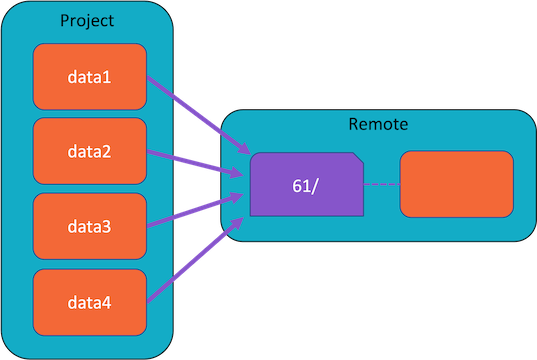
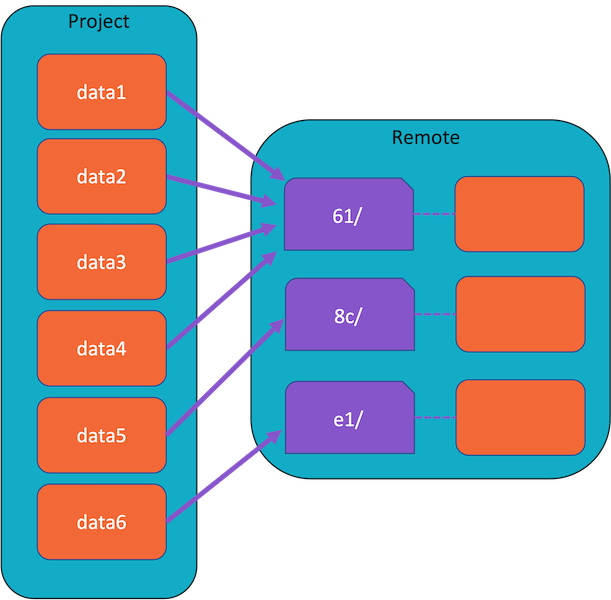
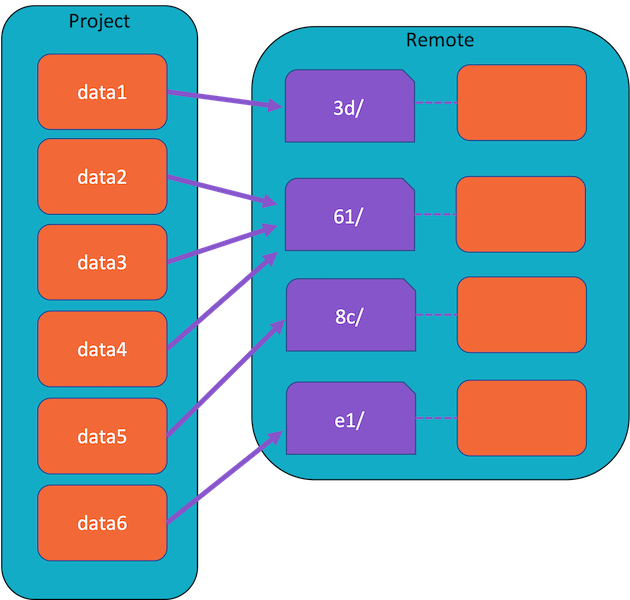

# Structure of remote cache by example

This is a tutorial-like example designed to explain the remote cache structure
and why it is like that. If you are not familiar how DVC remote caches are
structured this document will be useful to you. We assume you are familiar with
the `git` and can use it at the command line.

> While you can use any of the supported external caches, we will focus on
> Amazon S3 in this document. You can still follow the tutorial with a different
> cloud service provider and a different OS, but you may need to make
> adjustments to the commands. It is assumed that
>
> - you have an Amazon AWS account and have set up the AWS cli on your local PC
> - that you have set up an S3 bucket to be the remote cache
> - you have downloaded an AWSAccessKeyId and a AWSSecretKey which you have
>   configured on your local PC with `aws configure`.
> - we will use a OS X/Linux CLI

## Set up a simple project

To get started, we will set up a basic project tracked by both `git` and `dvc`.
The project will contain only data files and no pipelines, code or other
anything else; the aim is to keep the project as simple as possible so that the
remote cache ideas can be clearly illustrated.

Let's make a project called `project` and initialise it:

```dvc
$ mkdir project
$ cd project
$ git init
$ dvc init
```

So far, I have not connected `git` to any external repository. You can do that
easily enough later on, but we won't worry about that here.

What we do need is some data to add to the project. In machine learning
pipelines, data files can get quite large (e.g. hundreds of GB in size), but for
our purposes they will be small text files so that commands run fast, and they
will all contain the same content initially.

Using the `echo` command to pipe text into some text files is one way to achieve
this:

```dvc
$ echo data > data1
$ echo data > data2
$ echo data > data3
$ echo data > data4
```

Now let's tell DVC about these new data files and ask for them to be
specifically tracked:

```dvc
$ dvc add data1
$ dvc add data2
$ dvc add data3
$ dvc add data4
```

Once that is done, you will notice that `.dvc` file is created for each of the
original data files:

```dvc
$ ls
data1 data2 data3 data4
data1.dvc data2.dvc data3.dvc data4.dvc
```

The `dvc add` command should also have put all data files inside `.gitignore`,
which is a good idea because if these four identical data files were in reality
very big, it could take a long time to upload them to github and we want to
avoid that.

Let's check the `.gitignore` file then:

```dvc
% cat .gitignore
/data1
/data2
/data3
/data4
```

Thanksfully, the data files are all there!

Now we can do an initial commit of everything else using `git`, but first, let's
set up the connection between `dvc` and our remote S3 cache first.

When the remote cache is added, the file `.dvc/cache` will be updated with the
remote cache details, so we will need to add these to git as well:

```dvc
$ dvc remote add s3cache s3://path/to/your/cache/
$ git add .dvc/config
```

And finally let's finish with a initial commit:

```dvc
$ git commit -m "initial"
```

If you managed to get this far, we can now start talking about how the remote
cache is structured in relation to our project files.

## Pushing the DVC-tracked files to the remote cache

Now come's the interesting part!

> To fully appreciate how remote caches work, it's useful to understand the
> concept of _indirection_. Indirection refers to the naming of things using a
> reference.  
> For example, my name is "Mike", which is one indirect way of referring to the
> person that is me. Another way of referring to me could "Employee #25531" used
> by my company. Two indirect references to the same one person.

Back to the project. Let's now push our four data files to the remote cache:

```dvc
$ dvc push -r s3cache
1 file pushed
```

Notice the output of this command: `1 file pushed`. If you were following
through the previous section, you should know that _four_ data files were
created. You can double check this if you like:

```dvc
% ls
data1		data2		data3		data4
data1.dvc	data2.dvc	data3.dvc	data4.dvc
```

So why was only _one_ data file pushed?

If you have the `aws` command line tool set up (or whatever your equivalent is,
you could also browse your cache via the web), you could further check the
contents of the remote cache. Here's what the S3 cache looked like on my system:

```dvc
$ aws s3 ls s3://path/to/your/cache/
                           PRE 61/
2022-02-20 13:16:49          0
```

One folder `61/` has been created, and if you look inside this, the folder
contains only a single file with an obfuscated (hexademical) name.

So what's going on?

The answer, of course, is that the four data files were identical and so DVC
concluded that only one copy of the files really needed to be uploaded. The name
`61/` is an internal name for the file used to implement an indirection. So the
file `data1` on my local computer references `61/` on the remote cache, the file
`data2` on my local computer also references `61/`, and so on.

DVC determines which files are identical by comparing their MD5 hashes, and you
can confirm this by looking at the `.dvc` files for the four data files
yourself:

```dvc
$ cat *.dvc
outs:
- md5: 6137cde4893c59f76f005a8123d8e8e6
  size: 5
  path: data1
outs:
- md5: 6137cde4893c59f76f005a8123d8e8e6
  size: 5
  path: data2
outs:
- md5: 6137cde4893c59f76f005a8123d8e8e6
  size: 5
  path: data3
outs:
- md5: 6137cde4893c59f76f005a8123d8e8e6
  size: 5
  path: data4
```

Graphically, the project folder and the remote cache have this structure:



## Adding new data and how the remote cache changes

Let's add two more data files to our repository, but this time make them
different to the first four data files. We should also make sure DVC tracks the
new files and add the corresponding `.dvc` files with git:

```dvc
$ echo data3636363 > data5
$ echo blahblahblah > data6
$ dvc add data5
$ dvc add data6
$ git add data5.dvc
$ git add data6.dvc
$ git add .gitignore
$ git commit -m "added more data"
```

So... at this point we will have four identical data files (`data1`...`data4`)
and two new data files, `data5` and `data6`. Based on what happened the last
time we pushed data to the remote cache, we can predict that since the two new
data files are different to the others and two each other, they will both need
to be pushed to the remote cache. This, in fact, is exactly what happens:

```dvc
$ dvc push -r s3cache
2 files pushed
```

The remote cache will now have three different items, which you can see:

```dvc
$ aws s3 ls s3://path/to/your/cache/
                           PRE 61/
                           PRE 8c/
                           PRE e1/
2022-02-20 13:16:49          0
```

Graphically speaking, the setup will now look like this:



## Modifying existing data

Next, let's change one of the data files that used to be a duplicate and push
the changes to the remote cache:

```dvc
$ echo shshshshs > data1
$ dvc add data1
$ dvc push -r s3cache
1 file pushed
```

If this works, four different folders should exist in the remote cache
representing the six data files in the project:

```dvc
$ aws s3 ls s3://path/to/your/cache/
                           PRE 3d/
                           PRE 61/
                           PRE 8c/
                           PRE e1/
2022-02-20 13:16:49          0
```

We can finish off by adding the updated `.dvc` file to a git commit:

```dvc
$ git add data1.dvc
$ git commit -m "modified data"
```

The final configuration of the project and the remote will be this:



If you have made it this far, I hope this has cleared up some of the aspects of
how DVC's remote caches work and why the contents of the caches are typically
"obfuscated" in the way that they are.
